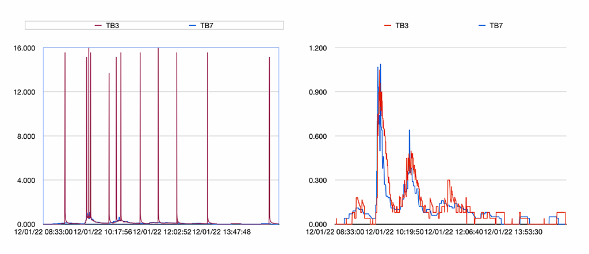

# weewx-rainrate
*Open source plugin for WeeWX software.

Copyright (C)2022 by John A Kline (john@johnkline.com)

**This extension requires Python 3.7 or later and WeeWX 4.**


## Description

weewx-rainrate is a WeeWX service that attempts to produce a
"better" rainRate in loop packets (and archive records) for
siphon tipping bucket rain gauges.

This extension will be useful for tipping
rain gauges that use a siphon for better accuracy over a wide
range of rainfall.  These professional gauges maintain their
accuracy over a wide range of rain intensity, but are
unsuitable for computing rain rate via the time
between two tips.  The reason for the unsuitability is that
a single discharge of the siphon may result in multiple tips
(in close sucession).  The result of two tips in close
succession will be a wildly overstated rain rate.

The impetus for this extension was the author's purchase of a
professional HyQuest Solutions TB3 tipping rain gauge with
siphon.  It is accurate to 2% at any rain intensity, but with
the siphon, two tips can come in quick succession.

The extension was tested with a HyQuest Solutions TB3 siphon
tipping bucket rain gauge and using a HyQuest Solutions TB7 (non-siphon)
tipping bucket rain gauge as a reference (for rain rate).

## Visualization

The following graphs show the rain rate over the period of a 0.68" storm in Palo Alto, CA on December 1, 2022.
The blue lines are the untouched rates of a HyQuest TB7 tipping bucket, which does not have
a siphon and, as such, is provided as a reference.

The red line shows the rain rate from a HyQuest TB3 tipping bucket, which does have a siphon and, as such,
suffers from multiple tips in close proximity.  The left graph shows the untouched rate of the TB3.  As one
can see, nonsensical rates of up to 15" per hour are shown.

On the right, this rainrate extension is used. The TB3 shows rain rates that track reasonably well with the TB7.


Reference TB7 in blue.  TB3 (red) on left without extension, on right with this extension.

## Algorithm

Coming soon.

# Installation Instructions

1. Download the lastest release, weewx-rainrate-0.15.zip, from the
   [GitHub Repository](https://github.com/chaunceygardiner/weewx-rainrate).

1. Run the following command.

   `sudo /home/weewx/bin/wee_extension --install weewx-rainrate-0.15.zip`

   Note: this command assumes weewx is installed in /home/weewx.  If it's installed
   elsewhere, adjust the path of wee_extension accordingly.

1. Restart WeeWX.

1. The following entry is created in `weewx.conf`.  To disable `weewx-rainrate` without
   uninstalling it, change the enable line to false.
```
[RainRate]
    enable = true
```

## Why require Python 3.7 or later?

weewx-rainrate code includes type annotation which do not work with Python 2, nor in
earlier versions of Python 3.

## Licensing

weewx-rainrate is licensed under the GNU Public License v3.
