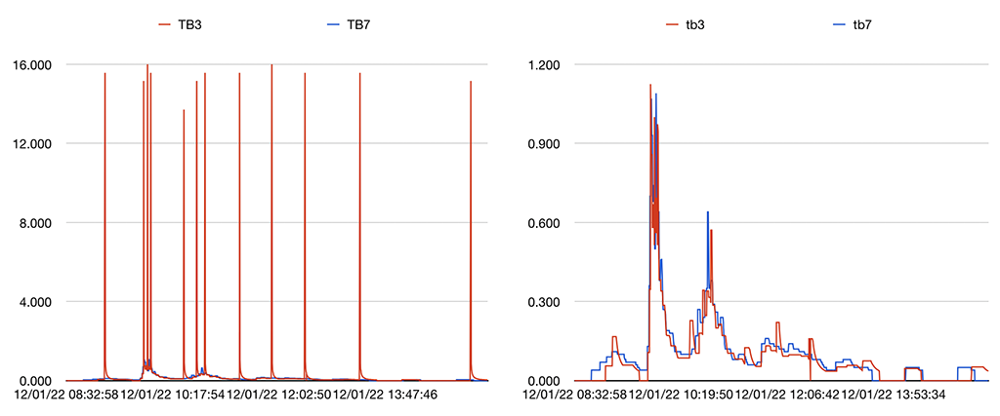
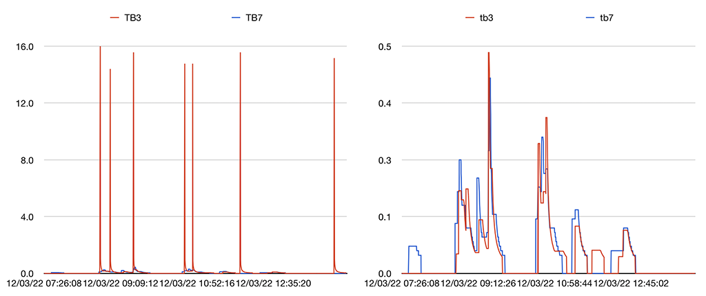

# weewx-rainrate
*Open source plugin for WeeWX software.

Copyright (C)2022 by John A Kline (john@johnkline.com)

**This extension requires Python 3.7 or later and WeeWX 4.**


## Description

weewx-rainrate is a WeeWX service that attempts to produce a
"better" rainRate in loop packets (and archive records) for
siphon tipping bucket rain gauges.

This extension will be useful for tipping
rain gauges that use a siphon for better accuracy over a wide
range of rainfall.  These professional gauges maintain their
accuracy over a wide range of rain intensity, but are
unsuitable for computing rain rate via the time
between two tips.  The reason for the unsuitability is that
a single discharge of the siphon may result in multiple tips
(in close sucession).  The result of two tips in close
succession will be a wildly overstated rain rate.

The impetus for this extension was the author's purchase of a
professional HyQuest Solutions TB3 tipping rain gauge with
siphon.  It is accurate to 2% at any rain intensity, but with
the siphon, two tips can come in quick succession.

The extension was tested with a HyQuest Solutions TB3 siphon
tipping bucket rain gauge and using a HyQuest Solutions TB7 (non-siphon)
tipping bucket rain gauge as a reference (for rain rate).

## Visualization

The following two images show rain rates during two storms in Palo Alto in
December of 2022.  The first yielded 0.68" of rain on December 1.
The second is the first part of a storm on December 3 (measuring 0.32" of rain).

The blue lines in each graph are the untouched rates of a HyQuest TB7 tipping bucket, which does not have a siphon and, as such, is provided as a reference.

The red lines show the rain rate from a HyQuest TB3 tipping bucket, which does have a siphon and, as such, can suffer from multiple tips at once.
The left graph in each image shows the untouched rain rate of the TB3.  As one
can see, nonsensical rates of up to 16" per hour are shown.

On the right, this rainrate extension is used. The TB3 shows rain rates that track reasonably well with the TB7.


Dec 1, 2022 storm.  Reference TB7 in blue.  TB3 (red) on left without extension, on right with this extension.


Dec 3, 2022 storm.  Reference TB7 in blue.  TB3 (red) on left without extension, on right with this extension.

The TB3 vs. TB7 `rain` and `rainRate` values in  archive records for an entire day where 2 1/2 inches of rain
fell can be .

## Algorithm

The key feature of this extension is that, when multiple tips are encountered in a loop record, the extension (for the purposes of calculating rain rate) records 1/2 of the amount at the current time.  It records the other half of the amount at a point midway between the last rain reported and the current time.

The exceptional case is where a multi-tip reading is encountered on the first tip of a storm (where a storm is defined as the time of the first tip through to a period of 30 minutes with no tips).  For this case, 0.01 of rain is recorded at the current time and remainder is recorded 15m earlier.

The rain rate is determined by combining the following two calculations:

1. The rate between the last two tips:
`3600.0 * rain_amount_of_most_recent_tip / (time_of_last_tip - time_of_previous_tip)`
The `rain_amount_of_most_recent_tip` will be 0.01 (since
multi-tips are split up).  The `time_of_previous_tip` is not the last rain
event; rather, it's the one before that.

1. The rate from the current time to the time of the previous tip.
`3600.0 * rain_amount_of_most_recent_tip / (now - time_of_previous_rain_event)`
The `rain_amount_of_most_recent_tip` will be 0.01 (since
multi-tips are split up).  The `time_of_previous_tip` is not the last rain
event; rather, it's the one before that.

The first rate (the rate between two tips) plays a much greater influence on the rate
when a tip has just occurred.  Over time, the second rate becomes the dominant influence
over the rate.  The influence of the second rate follows the slope of y=x^sqrt(2).

# Installation Instructions

1. Download the lastest release, weewx-rainrate-0.20.zip, from the
   [GitHub Repository](https://github.com/chaunceygardiner/weewx-rainrate).

1. Run the following command.

   `sudo /home/weewx/bin/wee_extension --install weewx-rainrate-0.20.zip`

   Note: this command assumes weewx is installed in /home/weewx.  If it's installed
   elsewhere, adjust the path of wee_extension accordingly.

1. Restart WeeWX.

1. The following entry is created in `weewx.conf`.  To disable `weewx-rainrate` without
   uninstalling it, change the enable line to false.
```
[RainRate]
    enable = true
```

## Why require Python 3.7 or later?

weewx-rainrate code includes type annotation which do not work with Python 2, nor in
earlier versions of Python 3.

## Licensing

weewx-rainrate is licensed under the GNU Public License v3.
